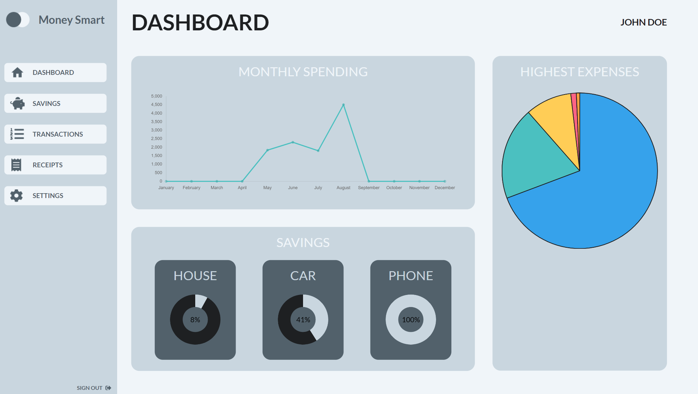
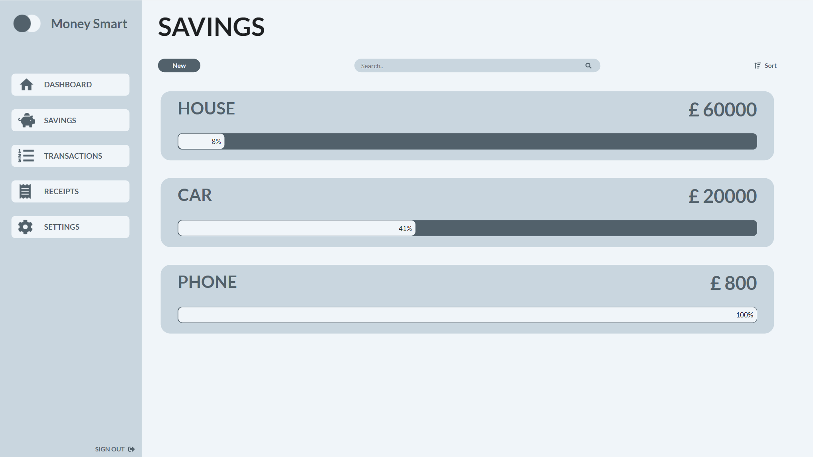
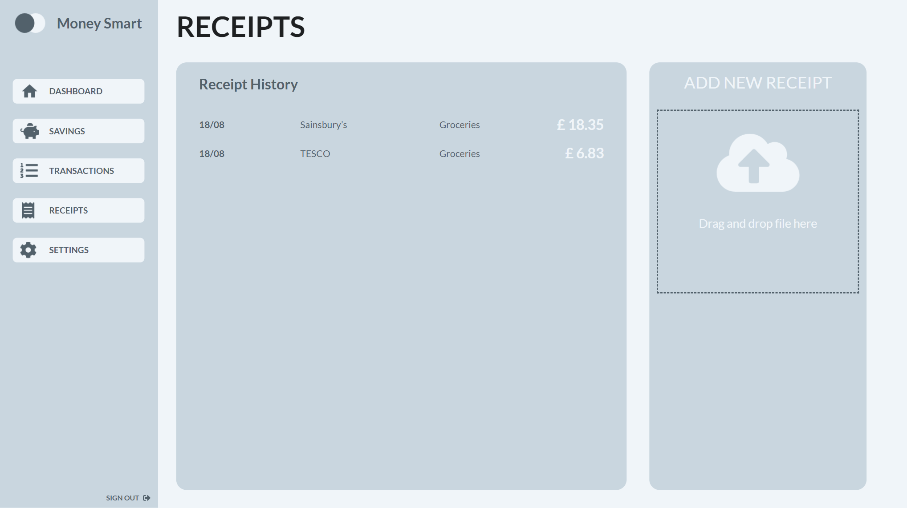

# Money Smart

The ultimate financial tracking tool created using the React, Redux, NodeJS and ChartsJS.

## Description

Welcome to Money Smart, a financial tracking tool to create savings, log transactions and store receipts. Saving up for a new product? Why not create a savings with the amount required. Continuously add money to the saving and track your progress of saving up. Track all your transactions, view your highest expenses using the pie chart and monthly spending using the line graphs. Money Smart implements TesseractJS to scan your receipts and extract the name and total amount from the receipt. Then you can store your receipts to view later and keep a track of your receipts. Using ChartsJS allows you to view all your financial information through the various, pie charts, line graphs and bar charts.

## Screenshots

## Getting Started

[Money Smart App](https://money-smart-app.herokuapp.com/)

## Key Features

- Create Savings
  - Track Your Progress When Saving Up For A New Item
  - View Information Using The Charts
- Log Transactions
  - Keep A Track Of Your Transactions
  - View Highest Expenses Using Pie Chart
  - View Monthly Spending Using Line Chart
- Store Receipts
  - TesseractJS Extracts Receipt Information
  - Keep Track Of Previous Receipts

## Help

If you experience any issues or common problems, feel free to create a new issue.

## Author(s)

Azhar Moosa

## Version History

- 0.1
  - Initial Release

## License

This project is licensed under the MIT License - see the LICENSE.md file for details

## Acknowledgments

- [font-awesome](https://fontawesome.com/)
